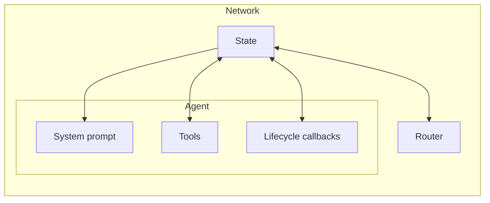

# AgentKit

_Build multi-agent networks with deterministic routing and rich tooling via MCP._


<p align="center">
    <a href="https://agentkit.inngest.com/overview">Documentation</a>
    <span>&nbsp;·&nbsp;</span>
    <a href="https://www.inngest.com/blog?ref=github-agent-kit-readme">Blog</a>
    <span>&nbsp;·&nbsp;</span>
    <a href="https://www.inngest.com/discord">Community</a>
</p>

AgentKit offers more deterministic and flexible routing, works with multiple model providers, embraces MCP (for rich tooling), and supports the unstoppable and growing community of TypeScript AI developers. Combined the Inngest Dev Server to start locally and its orchestration engine, making your Agents fault-tolerant when deployed to the cloud.

**Core concepts**

- [**Agents**](https://agentkit.inngest.com/concepts/agents): LLM calls that can be combined with prompts, [tools](https://agentkit.inngest.com/concepts/tools), and [MCP](https://agentkit.inngest.com/advanced-patterns/mcp).
- [**Networks**](https://agentkit.inngest.com/concepts/networks): a simple way to get Agents to collaborate with a shared State, including handoff.
- [**State**](https://agentkit.inngest.com/concepts/state): combines conversation history with a fully typed state machine, used in routing.
- [**Routers**](https://agentkit.inngest.com/concepts/routers): where the autonomy lives, from code-based to LLM-based (ex: ReAct) orchestration
- [**Tracing**](https://agentkit.inngest.com/getting-started/local-development): debug and optimize your workflow locally and in the cloud with built-in tracing

Get started now by [cloning our examples](https://agentkit.inngest.com/examples/overview) or [exploring the documentation](https://agentkit.inngest.com/overview).

## Get started

```tsx
npm i @inngest/agent-kit
```

## MCP Agent example

Choose your favorite MCP server on Smithery (or self-host one) to build an AgentKit Agent using MCP as tools. Here is an example using the [Neon database MCP server](https://smithery.ai/server/neon):

```tsx
import {
  anthropic,
  createAgent,
  createNetwork,
  createTool,
} from "@inngest/agent-kit";
import { createServer } from "@inngest/agent-kit/server";
import { createSmitheryUrl } from "@smithery/sdk/config.js";
import { z } from "zod";

const smitheryUrl = createSmitheryUrl("https://server.smithery.ai/neon/ws", {
  neonApiKey: process.env.NEON_API_KEY,
});

const neonAgent = createAgent({
  name: "neon-agent",
  system: `You are a helpful assistant that help manage a Neon account.
  IMPORTANT: Call the 'done' tool when the question is answered.
  `,
  tools: [
    createTool({
      name: "done",
      description: "Call this tool when you are finished with the task.",
      parameters: z.object({
        answer: z.string().describe("Answer to the user's question."),
      }),
      handler: async ({ answer }, { network }) => {
        network?.state.kv.set("answer", answer);
      },
    }),
  ],
  mcpServers: [
    {
      name: "neon",
      transport: {
        type: "ws",
        url: smitheryUrl.toString(),
      },
    },
  ],
});

const neonAgentNetwork = createNetwork({
  name: "neon-agent",
  agents: [neonAgent],
  defaultModel: anthropic({
    model: "claude-3-5-sonnet-20240620",
    defaultParameters: {
      max_tokens: 1000,
    },
  }),
  router: ({ network }) => {
    if (!network?.state.kv.get("answer")) {
      return neonAgent;
    }
    return;
  },
});

// Create and start the server
const server = createServer({
  networks: [neonAgentNetwork],
});

server.listen(3010, () =>
  console.log("Support Agent demo server is running on port 3010")
);
```

Get started with this example locally: [https://github.com/inngest/agent-kit/tree/main/examples/mcp-neon-agent#readme](https://github.com/inngest/agent-kit/tree/main/examples/mcp-neon-agent#readme)

You will find other examples in the sections below.

## Deterministic Routing with State-based routing

AgentKit provides a unique approach to deterministic Routing with State-based routing that enables the implementation of code-based to fully autonomous routing while keeping control all along the way.

The State is a key value stored and shared between all the Agents of the same network.

This state is then accessible from the router, agent lifecycle callbacks, agent prompts, and agent tools:



_The bidirectional arrows illustrate an R/W write access, while the one-way arrows have an R/O access._

This shared State, combined with the network's message history, is the building block of AgentKit's deterministic stated-based routing.

### Code-based routing

We recommend starting with a code-based routing that provides complete control over your network execution flow.

This routing pattern is the most deterministic. By providing a Routing function that gets access to the state and history, you will implement an agentic routing that reacts to the state updates performed by the Agents’ tools.

Here is an example of a Coding Agent using a code-based router to orchestrate the agents of the network based on the plan generated by the `codeAssistantAgent`:

```tsx
import { z } from "zod";
import {
  anthropic,
  createAgent,
  createNetwork,
  createTool,
} from "@inngest/agent-kit";

import { readFileSync } from "fs";
import { join } from "path";

// create a shared tool
const saveSuggestions = createTool({
  name: "save_suggestions",
  description: "Save the suggestions made by other agents into the state",
  parameters: z.object({
    suggestions: z.array(z.string()),
  }),
  handler: async (input, { network }) => {
    const suggestions = network?.state.kv.get("suggestions") || [];
    network?.state.kv.set("suggestions", [
      ...suggestions,
      ...input.suggestions,
    ]);
    return "Suggestions saved!";
  },
});

// create agents with access to the state via the `saveSuggestions` tool
const documentationAgent = createAgent({
  name: "documentation_agent",
  system: "You are an expert at generating documentation for code",
  tools: [saveSuggestions],
});

const analysisAgent = createAgent({
  name: "analysis_agent",
  system: "You are an expert at analyzing code and suggesting improvements",
  tools: [saveSuggestions],
});

const summarizationAgent = createAgent({
  name: "summarization_agent",
  system: ({ network }) => {
    const suggestions = network?.state.kv.get("suggestions") || [];
    return `Save a summary of the following suggestions:
    ${suggestions.join("\n")}`;
  },
  tools: [
    createTool({
      name: "save_summary",
      description:
        "Save a summary of the suggestions made by other agents into the state",
      parameters: z.object({
        summary: z.string(),
      }),
      handler: async (input, { network }) => {
        network?.state.kv.set("summary", input.summary);
        return "Saved!";
      },
    }),
  ],
});

// Create the code assistant agent which generates a plan
const codeAssistantAgent = createAgent({
  name: "code_assistant_agent",
  system: ({ network }) => {
    const agents = Array.from(network?.agents.values() || [])
      .filter(
        (agent) =>
          !["code_assistant_agent", "summarization_agent"].includes(agent.name)
      )
      .map((agent) => `${agent.name} (${agent.system})`);
    return `From a given user request, ONLY perform the following tool calls:
- read the file content
- generate a plan of agents to run from the following list: ${agents.join(", ")}

Answer with "done" when you are finished.`;
  },
  tools: [
    createTool({
      name: "read_file",
      description: "Read a file from the current directory",
      parameters: z.object({
        filename: z.string(),
      }),
      handler: async (input, { network }) => {
        const filePath = join(process.cwd(), `files/${input.filename}`);
        const code = readFileSync(filePath, "utf-8");
        network?.state.kv.set("code", code);
        return "File read!";
      },
    }),
    createTool({
      name: "generate_plan",
      description: "Generate a plan of agents to run",
      parameters: z.object({
        plan: z.array(z.string()),
      }),
      handler: async (input, { network }) => {
        network?.state.kv.set("plan", input.plan);
        return "Plan generated!";
      },
    }),
  ],
});

const network = createNetwork({
  name: "code-assistant-v2",
  agents: [
    codeAssistantAgent,
    documentationAgent,
    analysisAgent,
    summarizationAgent,
  ],
  // our routing function relies on the shared state to orchestrate agents
  //   first, the codeAssistantAgent is called and then, its plan gets
  //   executed step by step until a summary gets written in the state.
  router: ({ network }) => {
    if (!network?.state.kv.has("code") || !network?.state.kv.has("plan")) {
      return codeAssistantAgent;
    } else {
      const plan = (network?.state.kv.get("plan") || []) as string[];
      const nextAgent = plan.pop();
      if (nextAgent) {
        network?.state.kv.set("plan", plan);
        return network?.agents.get(nextAgent);
      } else if (!network?.state.kv.has("summary")) {
        return summarizationAgent;
      } else {
        return undefined;
      }
    }
  },
  defaultModel: anthropic({
    model: "claude-3-5-sonnet-latest",
    defaultParameters: {
      max_tokens: 4096,
    },
  }),
});
```

The source code is available here: [https://github.com/inngest/agent-kit/blob/main/examples/code-assistant-agentic/src/index.ts](https://github.com/inngest/agent-kit/blob/main/examples/code-assistant-agentic/src/index.ts)

### Agent-based routing

The Agent-based routing replaces the routing function with an Agent. This enables your network of agents to autonomously select which agents to execute and decide when the tasks are completed.

A Routing Agent comes with an `onRoute` lifecycle callback that recalls the code-based routing approach. This lifecycle callback is your gateway to keep control of the Agent routing decision.

The below example showcases a Support Agent using a Routing Agent as a “Supervisor”:

```tsx
import {
  anthropic,
  createAgent,
  createNetwork,
  createRoutingAgent,
  createTool,
} from "@inngest/agent-kit";
import { z } from "zod";

import { isLastMessageOfType, lastResult } from "./utils.js";

import { knowledgeBaseDB, releaseNotesDB, ticketsDB } from "./databases.js";

// Create shared tools
const searchKnowledgeBase = createTool({
  name: "search_knowledge_base",
  description: "Search the knowledge base for relevant articles",
  parameters: z.object({
    query: z.string().describe("The search query"),
  }),
  handler: async ({ query }, { step }) => {
    return await step?.run("search_knowledge_base", async () => {
      // Simulate knowledge base search
      const results = knowledgeBaseDB.filter(
        (article) =>
          article.title.toLowerCase().includes(query.toLowerCase()) ||
          article.content.toLowerCase().includes(query.toLowerCase())
      );
      return results;
    });
  },
});

const searchLatestReleaseNotes = createTool({
  name: "search_latest_release_notes",
  description: "Search the latest release notes for relevant articles",
  parameters: z.object({
    query: z.string().describe("The search query"),
  }),
  handler: async ({ query }, { step }) => {
    return await step?.run("search_latest_release_notes", async () => {
      // Simulate knowledge base search
      const results = releaseNotesDB.filter(
        (releaseNote) =>
          releaseNote.title.toLowerCase().includes(query.toLowerCase()) ||
          releaseNote.content.toLowerCase().includes(query.toLowerCase())
      );
      return results;
    });
  },
});

const getTicketDetails = async (ticketId: string) => {
  const ticket = ticketsDB.find((t) => t.id === ticketId);
  return ticket || { error: "Ticket not found" };
};

// Create our agents
const customerSupportAgent = createAgent({
  name: "Customer Support",
  description:
    "I am a customer support agent that helps customers with their inquiries.",
  system: `You are a helpful customer support agent.
Your goal is to assist customers with their questions and concerns.
Be professional, courteous, and thorough in your responses.`,
  model: anthropic({
    model: "claude-3-5-haiku-latest",
    defaultParameters: {
      max_tokens: 1000,
    },
  }),
  tools: [
    searchKnowledgeBase,
    createTool({
      name: "update_ticket",
      description: "Update a ticket with a note",
      parameters: z.object({
        ticketId: z.string().describe("The ID of the ticket to update"),
        priority: z.string().describe("The priority of the ticket"),
        status: z.string().describe("The status of the ticket"),
        note: z.string().describe("A note to update the ticket with"),
      }),
      handler: async ({ ticketId, priority, status, note }, { step }) => {
        return await step?.run("update_ticket", async () => {
          // TODO: Update the ticket in the database
          return { message: "Ticket updated successfully" };
        });
      },
    }),
  ],
});

const technicalSupportAgent = createAgent({
  name: "Technical Support",
  description: "I am a technical support agent that helps critical tickets.",
  system: `You are a technical support specialist.
Your goal is to help resolve critical tickets.
Use your expertise to diagnose problems and suggest solutions.`,
  model: anthropic({
    model: "claude-3-5-haiku-latest",
    defaultParameters: {
      max_tokens: 1000,
    },
  }),
  tools: [searchLatestReleaseNotes],
});

// Create our Routing Agent that will orchestrate the network of agents
//  and evaluate if the support request is answered.
const supervisorRoutingAgent = createRoutingAgent({
  name: "Supervisor",
  description: "I am a Support supervisor.",
  system: `You are a supervisor.
Your goal is to answer customer initial request or escalate the ticket if no answer can be provided.
Choose to route tickets to the appropriate agent using the following instructions:
- Critical tickets should be routed to the "Technical Support" agent.
- Actions such as updating the ticket or handling non-critical tickets should be routed to the "Customer Support" agent.

Think step by step and reason through your decision.
When an agent as answered the ticket initial request or updated the ticket, call the "done" tool.`,
  model: anthropic({
    model: "claude-3-5-haiku-latest",
    defaultParameters: {
      max_tokens: 1000,
    },
  }),
  tools: [
    createTool({
      name: "done",
      description: "Call this when the ticket is solved or escalated",
      handler: async () => {},
    }),
    createTool({
      name: "route_to_agent",
      description: "Route the ticket to the appropriate agent",
      parameters: z.object({
        agent: z.string().describe("The agent to route the ticket to"),
      }),
      handler: async ({ agent }) => {
        return agent;
      },
    }),
  ],
  lifecycle: {
    onRoute: ({ result, network }) => {
      const lastMessage = lastResult(network?.state.results);

      // ensure to loop back to the last executing agent if a tool has been called
      if (lastMessage && isLastMessageOfType(lastMessage, "tool_call")) {
        return [lastMessage?.agent.name];
      }

      const tool = result.toolCalls[0];
      if (!tool) {
        return;
      }
      const toolName = tool.tool.name;
      if (toolName === "done") {
        return;
      } else if (toolName === "route_to_agent") {
        if (
          typeof tool.content === "object" &&
          tool.content !== null &&
          "data" in tool.content &&
          typeof tool.content.data === "string"
        ) {
          return [tool.content.data];
        }
      }
      return;
    },
  },
});

// Create a network with the agents with the routing agent
const supportNetwork = createNetwork({
  name: "Support Network",
  agents: [customerSupportAgent, technicalSupportAgent],
  defaultModel: anthropic({
    model: "claude-3-5-haiku-latest",
    defaultParameters: {
      max_tokens: 1000,
    },
  }),
  router: supervisorRoutingAgent,
});
```

Try this agent network locally: [https://github.com/inngest/agent-kit/tree/main/examples/support-agent-human-in-the-loop#readme](https://github.com/inngest/agent-kit/tree/main/examples/support-agent-human-in-the-loop#readme)

> Both approaches are compatible with the `maxIter` parameters that enable you to put a maximum number of network iterations.
> We recommend always setting a `master` value when using Agent-based routing.

## Examples

- [**The AgentKit SWE-bench example**](https://github.com/inngest/agent-kit/tree/main/examples/swebench#readme) demonstrates how to build a network of agents solving a complex SWE bench challenge.
- [**The Simple Search Agent**](https://github.com/inngest/agent-kit/tree/main/examples/simple-search-stagehand#readme) navigates the web autonomously to answer the given question
- [**The Support Agent**](https://github.com/inngest/agent-kit/tree/main/examples/support-agent-human-in-the-loop#readme) demonstrates how Inngest’s `waitForEvent()` enables the Agent to ask a human for help.
- [**The Coding Agent**](https://github.com/inngest/agent-kit/tree/main/examples/e2b-coding-agent#readme) replicates the Cursor’s Agent mode, creating a complete project from a simple prompt.

## Contributing

After cloning the repository:

1. Ensure that you have `node` and `pnpm` installed

```tsx
node -v # should be > 20.x

pnpm -v # should be > 9.x
```

2. Install dependencies:

```tsx
pnpm i
```

3. Build the package or run tests:

```tsx
pnpm build

pnpm test
```

**License**

[Apache 2.0](https://github.com/inngest/agent-kit/blob/main/LICENSE.md)
